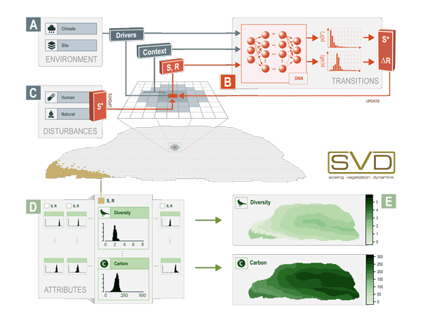

# SVD
*Scaling vegetation dynamics*

SVD is a novel approach for scaling vegetation dynamics, that facilitates Deep Neural networks for predicting vegetation transitions. 

A high-level conceptual view is depicted below:

> Conceptual view on the SVD framework. Vegetation transitions on a single cell are estimated by a Deep Neural Network (B) contingent on environmental factors (A), the current vegetation state (S), the residence time (R) and the spatial context. The model determines transitions by sampling from the DNN-derived probability distributions for the future state (S\*) and the time until state change (ΔR). Human and natural disturbances (C) add an abrupt pathway for vegetation transitions. Density distributions of ecosystem attributes of interest are linked to combinations of S×R (D). These state- and residence time-specific attribute distributions can subsequently be used to predict changes in the spatial distribution of these attributes based on the simulated vegetation transitions SVD (E).
> 

## Documentation
The documentation of SVD is available from various sources:
### [this docs folder](docs/README.md)
### [Documentation on GitHub.io](https://svdmodel.github.io/SVD)
### Peer reviewed scientifc papers
* tbc

## Example applications (models)
Example applications of SVD and data and code for training DNNs are available at https://github.com/SVDmodel/models

