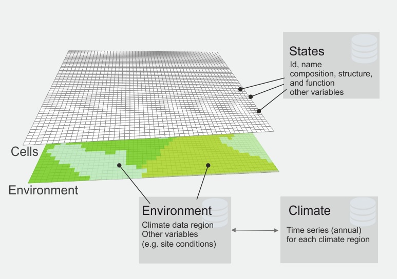

# Configuring the landscape
The simulated landscape is a (large) grid of `cells` with a cell size of 100m. Additional spatial layers
specify properties of the environment (site and climate conditions). A cell has also a [state](states.md) and a
residence time. The figure below provides a conceptual view:

*A landscape in SVD. Each cell of the landscape is situated within an environmental region, which is linked
to a climate region. In addition, each cell is in a specific state.*

The simulated landscape is defined by a grid (`landscape.grid`) and an accompanying data table (`landscape.file`).
The metric coordinates of the landscape grid define the extent of the simulated area. 

The value of each grid cell is an integer Id ("environmentId") and values >0 indicate environment regions. 
All pixels with the same numeric grid value share the same environmental conditions. A value of 0 indicates 
that a cell is not simulated by SVD. The grid format is
a standard ASCII grid file, and the expected resolution is 100m.

The data table is a text file with a row for each environmentId (i.e. multiple grid cells can refer to the same
row in the table). The required columns of the table are:

Column | Description
-------|------------
id     | The unique environment Id
climateId | an Id that defines the climate region; the Id is linked to climate data 

The hierarchical structure helps to reduce the amount of data that SVD needs to process: 
* multiple cells (100m resolution) can share environmental conditions (e.g., site variables)
* multiple environmental zones can share the same climatic data

For example, say we have climate information at 4km, and soil information at 1km resolution. In this case 
(and assuming aligned grids) 100 SVD cells share the environment vector, and 16 environment zones (1600 cells)
share the climate data. Note that it is of course possible to establish 1:1 relations (i.e. for each cell 
one row in the environment file one climate region (and consequently climate time series)).

### Additional variables
In addition to the fixed variables `id` and `climateId` further (numeric) variables can be defined and 
subsequently used in [expressions](variables.md). The column name in the `landscape.file` is used as the variable name.
Typically, such variables refer to site conditions (e.g., soil depth, available nitrogen, ..).

### Initial vegetation conditions
At the start of the simulation each cell is assigned a initial state and residence time. See the [project file](project_file) 
for details.

