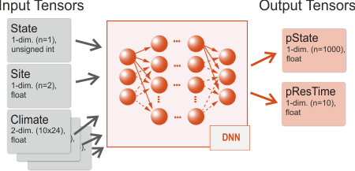

# Configuring the DNN

SVD integrates [Tensorflow](http://tensorflow.org) and allows thus to run
any trained Deep Neural Network within the framework. 

A conceptual view is depicted below: 



The network architecture of the DNN defines not only the layers of the network,
but also the shapes and types of the input and output data. SVD 
adopts a "multiple-inputs/multiple-outputs" model, where a single network
is trained to be fed simultaneously with data from multiple inputs, and provides multiple outputs as result.
Typical inputs are the current state and residence time of a cell, climate and site conditions, typical
outputs are a probability distribution for the next state S*, and a distribution for the time until state change.

Each of this inputs and outputs is (in Deep Learning lingo) a tensor, i.e. a multidimensional array of data
with a given shape (the number of dimensions and the size along each axis of the tensor) and type (the internal
data type of the tensor, for example floating point or integer). The input/output data needs to comply with the
definition of the tensors both during the training and inference phase.

In order to integrate (an existing) DNN with SVD one needs to:
* define each input tensor (name, shape, data type)
* define which data items should be fed into the tensors during a SVD simulation
* further define potential transformation of those data items (often data is scaled or otherwise transformed for better DNN performance)

## Input tensors

SVD includes a flexible mechanism to define input tensors and provides several pre-defined and user defined 
input "slots". The input tensors are defined in a configuration file which is set by the `dnn.metadata` setting.

Here is an example of a pre-defined slot:
```
# defines the tensor "climate" with data type "float" 
# and 2 dimensions (10 years x 24 values per year).
# The slot is "Climate" 
input.climate.enabled=true
input.climate.dim=2
input.climate.sizeX=10
input.climate.sizeY=24
input.climate.dtype=float
input.climate.type=Climate
```

SVD detects the pre-defined type `Climate` and sets up a link to the available climate data in the model. The 
name of the tensor is `climate` (as in `input.climate`), and the data is a 2-dimensional matrix with 10x24 values.
For each cell that should be processed by the DNN SVD populates the tensor with climate
data for the next 10 years (in this case the time series consists of 24 values per year).

Another example with user defined input data:

```
# defines the tensor "site" with data type "float"
# and 1 dimension (2 values)
# The type is "Var" 
input.site.enabled=true
input.site.dim=1
input.site.sizeX=2
input.site.sizeY=0
input.site.dtype=float
input.site.type=Var
input.site.transformations={availableNitrogen/100}, {pctSand/100}
```
In this case SVD fills for each cell the two variables in the input tensor 
with `availableNitrogen/100` and `pctSand/100`. `availableNitrogen` and `pctSand` need to be
available in the model (e.g. provided as environment variables in `landscape.file`). Note that
the data values are transformed on the fly. The name of the tensor is `site`. 

A more detailed description of the available input slots is given on the [DNN metadata](configuring_dnn_metadata.md) page.

## Output tensors
SVD expects two output tensors of the DNN:
* a probability distribution for the next state. The distribution is typically the result of a `Softmax` layer which
provides for each potential state a values between 0 and 1. For example, if there are 1000 possible states, the output
tensor is expected to be a 1-dimensional vector with 1000 values (float). The output tensor is specified in the
main configuration file with the `dnn.state.name` (name of the tensor), and `dnn.state.N` (the number of classes).
* a probability distribution for the time of state change. Again, the tensor is the result of a `Softmax` operation
and the tensor is specified with the `dnn.restime.name` and `dnn.restime.N` settings.
