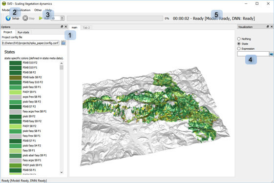

# Running SVD

## SVD software
A pre-built version of the SVD model software is currently available only for 
Windows (https://github.com/SVDmodel/SVD/executable). The software bundles 
a compiled version of TensorFlow ([with GPU support](https://www.tensorflow.org/install/gpu), `tensorflow.dll`). 
In order to use this version of SVD, a compatible GPU and the necessary libraries are required (e.g. 
CUDA, see https://www.tensorflow.org/install/gpu).

SVD versions that do not require GPU support are planned for the future. 

Alternatively, SVD can be compiled from source (see [Installation guide](install.md)).

## Operating SVD

Start SVD by running the executable (`SVDUI.exe`).

Main controls of SVD (see image above):

* (1): select a [configuration file](project_file.md) from the project folder (e.g. `config.conf`)
* (2): Click on `Setup`: this loads the project and all required data. Status information is shown in the
area (5). In addition, SVD creates a detailed log file during setup and execution (the path to the log
file is configured in the [configuration file](project_file.md)).
* (3): Run the model for the given number of time steps (=years). 
* (4): Visualization: SVD includes a powerful 3D visualization. Use the right mouse button for rotate and 
zoom operations. The data category for visualization can be selected in the right hand panel. 
	* "State": shows the state associated with each cell (using the color specified in the state table)
	* "Expression": type in any valid [expression](variables.md) (e.g., `soilDepth/100`). A list of all
	available variables is provided in the log file of SVD.

### Notes

#### Check the log file
The SVD log file is the primary tool for diagnosing problems during the model setup and during execution.
You can specify different levels of log verbosity in the [configuration file](project_file.md)

#### Outputs of SVD
Outputs of SVD are either tabular or spatial data (i.e., tables or grids) - see [data formats in SVD](SVD_data_formats.md).
Outputs are configured in the [configuration file](project_file.md). The link to attribute data 
(vegetation attribute database) is currently not directly supported from SVD.